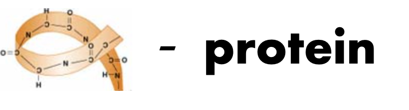

# Alpha-Protein: Protein Contact-map Prediction Boosted by Attention

This is the official repository of "Alpha-Protein: Protein Contact-map Prediction Boosted by Attention".

## Introduction

In this work, we reviewed the previous protein contact-map prediction models and applied the several attention mechanisms into the classic protein contact-map prediction networks ResPRE. The combination has reached a relatively great results, which improve both short-term and long-term prediction by approximately 6%. After all,


In the repository, we implement the following classic models:

- DeepCov [1];
- ResPRE [2];
  
as well as our proposed models

- Cbam-ResPRE based on Cbam attention mechanism [3] and ResPRE model;
- SE-ResPRE based on squeeze-and-excitation attention mechanism [4] and ResPRE model;
- Halo-ResPRE based on Halo block attention mechanism [5] and ResPRE model;
- NL-ResPRE based on non-local attention mechanism [6] and ResPRE model.

We also provides models for ablation studies, namely FC-Res-PRE, Cbam-FC-ResPRE and SE-FC-ResPRE, which are based on ResPRE, Cbam-ResPRE and SE-ResPRE respectively except only changing the kernel size of the final convolution block to 1x1 according to the idea of FCN [7]. A dilated residual network named DilatedResnet34 [8] is also provided for ablation studies in order to see whether the dilation [10] process may improve the performances.

## Requirements

Execute the following commands to install the required packages.

```bash
pip install -r requirements.txt
```

## Data Preparation

Download our provided dataset `feature.zip` and `label.zip` from [Google Drive](https://drive.google.com/drive/folders/1rDsIOE8eAVL46tMMjZTsk94c8TVlLBUV?usp=sharing), and unzip them into the `data` directory. After that, execute the following commands to divide them into training set, validation set and testing set.

```bash
python utils/preprocessing.py
```

You can also download the prepared dataset from [Baidu Netdisk](https://pan.baidu.com/s/1XJ5o8TTQT7HFG4w3XcMR7w) (Extract Code: fcjv), which does not need the previous preparation process.

Our dataset provides the precision matrix (PRE) of size `L * L * 441`, and ground-truth labels of `L * L * 10`. Notice that our dataset is a 10-class classification task, rather than the traditional binary classification task in protein contact-map prediction. Specifically, our dataset divide the distance into ten categories, namely 0-4Å, 4-6Å, 6-8Å, ..., 18-20Å, >20Å, instead of the traditional two categories 0-8Å and >8Å. Therefore, our datasets are a more challenging task.

You can also prepare your own datasets, see [docs/data_preparation.md](docs/data_preparation.md) for details.

## Pretrained Models

You can download full pretrained models from [Google Drive](https://drive.google.com/drive/folders/10n0MPoP6MEXmNliQpJkCdKJTShV5YCOv?usp=sharing) or [Baidu Netdisk](https://pan.baidu.com/s/1_Wh3ORfXH5faYkcEXx4_Ng) (Extract Code: jl6n). After downloading the each pretrained models, put it under the `checkpoint` folder (if the folder does not exist, then create it by yourself). Then, you can directly use it for testing or fine-tuning. Please see [docs/pretrained_models.md](docs/pretrained_models.md) for details.

## Models

This repository provides totally 10 models, namely

- DeepCov model;
- ResPRE model;
- Cbam-ResPRE model;
- SE-ResPRE model;
- Halo-ResPRE model, where the Halo block refers to the implementation of [lucidrains](https://github.com/lucidrains/) [9];
- NL-ResPRE model;
- FC-ResPRE model used for ablation studies;
- Cbam-FC-ResPRE model used for ablation studies;
- SE-FC-ResPRE model used for ablation studies;
- Dilated-Resnet34 model used for ablation studies.

Please see [docs/models.md](docs/models.md) for details.

## Configurations

Before training, fine-tuning or testing of the models, please set up your own configurations correctly. Please see [docs/configurations.md](docs/configurations.md) for details.

## Training (Optional)

Execute the following command to begin training.

```bash
python train.py --cfg [Config File] 
                (--clean_cache)
```

where `[Config File]` is `config/default.yaml` by default, which points to a sample network (SampleNet). The optional `--clean_cache` will automatically clean the caches after every epochs to save the GPU memory.

If you want to select a model from all checkpoints (the training results after each epoch) , please execute the following command.

```bash
python selector.py --cfg [Config File] 
                   --path [File Saving Path] 
                   (--clean_cache)
```

which will automatically test all the checkpoints **on the validation set** and save the result into a csv file in `[File Saving Path]` named `test_[Network Name].csv`, which includes the accuracy and scores of every checkpoint of the model. Then you can choose the model based on the testing result.

## Testing

Execute the following command to test the saved model.

```bash
python test.py --cfg [Config File] 
               (--clean_cache)
```

where `[Config File]` is `config/default.yaml` by default, which points to a sample network (SampleNet). The optional `--clean_cache` will automatically clean the caches after every epochs to save the GPU memory. Notice that the testing model should have a name of `checkpoint_[Network Name].tar` in `checkpoint` folder, where `[Network Name]` is the network name specified in the configuration file.

## Metrics

We evaluate both the short-term metrics and the long-term metrics, including top-L, top-L/2, top-L/5 and top-L/10. And we define a score based on these metrics, which has the folloing form:

```python
score = (3 * ST1 + 2 * ST2 + 5 * ST5 + ST10) + 2 * (3 * LT1 + 2 * LT2 + 5 * LT5 + LT10)
```

where `ST1`, `ST2`, `ST5` and `ST10` are the short-term top-L/10, top-L/5, top-L/2, top-L metrics respectively, and `LT1`, `LT2`, `LT5` and `LT10` are the long-term top-L/10, top-L/5, top-L/2, top-L metrics respectively.

Here is the table of the performance of all models except NL-ResPRE due to memory reason, based on our provided dataset and our provided pretrained models. We use the notations introduced above to simplify the table.

| Models | ST1 | ST2 | ST5 | ST10 | LT1 | LT2 | LT5 | LT10 | Score
| :-: | :-: | :-: | :-: | :-: | :-: | :-: | :-: | :-: | :-: |
| DeepCov (baseline) | 0.6947 | 0.6763 | 0.6282 | 0.5747 | 0.4672 | 0.4453 | 0.4057 | 0.3710 | 16.29 |
| ResPRE (baseline) | 0.6841 | 0.6731 | 0.6258 | 0.5670 | 0.4687 | 0.4499 | 0.4013 | 0.3577 | 16.19 |
| FC-ResPRE (ours) | 0.6999 | 0.6808 | 0.6331 | 0.5783 | 0.4990 | 0.4665 | 0.4147 | 0.3747 | 16.68 |
| Dilated-Resnet34 (ablation study) | 0.6572 | 0.6366 | 0.5934 | 0.5472 | 0.4674 | 0.4424 | 0.4060 | 0.3731 | 15.89 |
| Cbam-ResPRE (ours) | 0.6749 | 0.6552 | 0.6198 | 0.5793 | 0.4973 | 0.4714 | 0.4284 | 0.3878 | 16.68 |
| Cbam-FC-ResPRE (ours) | 0.7534 | 0.7269 | 0.6639 | **0.5942** | 0.4848 | 0.4576 | 0.4144 | 0.3775 | 16.97 |
| SE-ResPRE (ours) | 0.7094 | 0.6819 | 0.6303 | 0.5793 | 0.4934 | 0.4676 | 0.4304 | 0.3938 | 16.86 |
| SE-FC-ResPRE (ours) | 0.7120 | 0.6928 | 0.6426 | 0.5839 | 0.5040 | 0.4741 | **0.4329** | **0.3939** | 17.06 |
| Halo-ResPRE (ours) | **0.7590** | **0.7336** | **0.6680** | 0.5922 | **0.5054** | **0.4750** | 0.4250 | 0.3797 | **17.28** |

## Citation

If you found our work useful, please cite the following items.

```bibtex
@misc{fang2021alphaprotein,
  author =       {Hongjie Fang, Zhanda Zhu, Peishen Yan and Hao Yin},
  title =        {Alpha Protein: Protein Contact-map Prediction Boosted by Attention},
  howpublished = {\url{https://github.com/Galaxies99/alpha-protein}},
  year =         {2021}
}
```

## References

1. Jones, David T., and Shaun M. Kandathil. "High precision in protein contact prediction using fully convolutional neural networks and minimal sequence features." Bioinformatics 34.19 (2018): 3308-3315.

2. Li, Yang, et al. "ResPRE: high-accuracy protein contact prediction by coupling precision matrix with deep residual neural networks." Bioinformatics 35.22 (2019): 4647-4655.

3. Woo, Sanghyun, et al. "Cbam: Convolutional block attention module." Proceedings of the European conference on computer vision (ECCV). 2018.

4. Hu, Jie, Li Shen, and Gang Sun. "Squeeze-and-excitation networks." Proceedings of the IEEE conference on computer vision and pattern recognition. 2018.
  
5. Vaswani, Ashish, et al. "Scaling local self-attention for parameter efficient visual backbones." arXiv preprint arXiv:2103.12731 (2021).

6. Wang, Xiaolong, et al. "Non-local neural networks." Proceedings of the IEEE conference on computer vision and pattern recognition. 2018.

7. Long, Jonathan, Evan Shelhamer, and Trevor Darrell. "Fully convolutional networks for semantic segmentation." Proceedings of the IEEE conference on computer vision and pattern recognition. 2015.

8. Jiayan Xu. "Protein Contact Map Prediction Using Deep Convolutional Neural Network." master thesis of Shanghai Jiao Tong University (2019).

9. lucidrains/halonet-pytorch, Github repository: [https://github.com/lucidrains/halonet-pytorch](https://github.com/lucidrains/halonet-pytorch)

10. Yu, Fisher, and Vladlen Koltun. "Multi-scale context aggregation by dilated convolutions." arXiv preprint arXiv:1511.07122 (2015).
