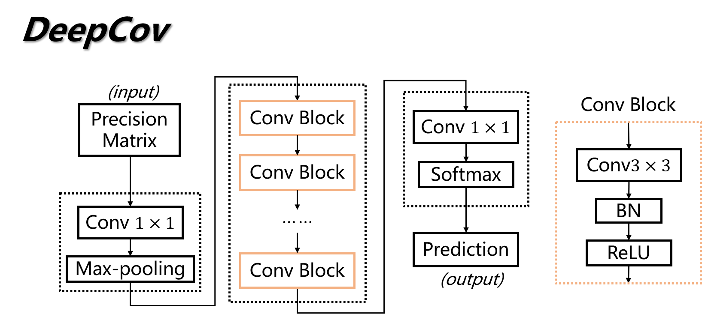
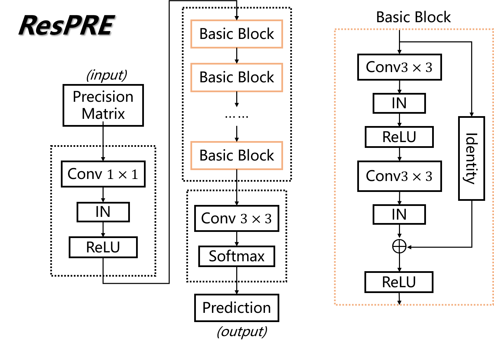
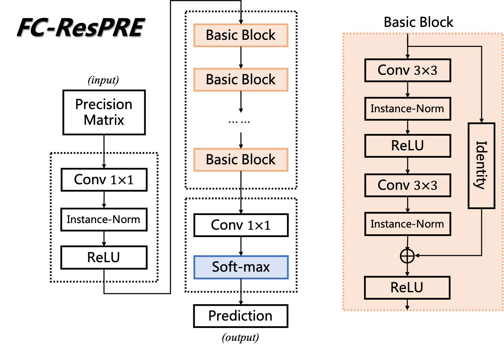
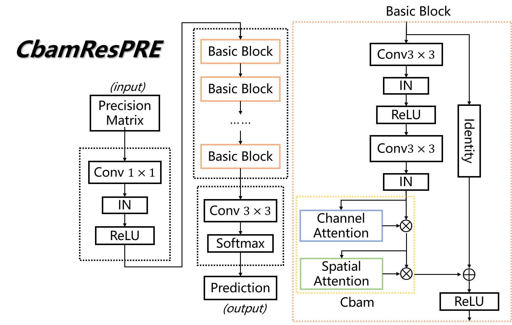
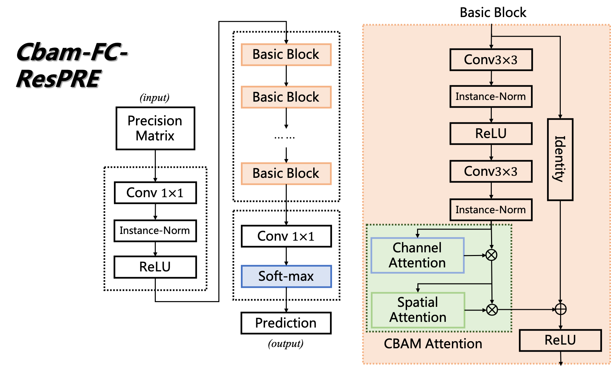
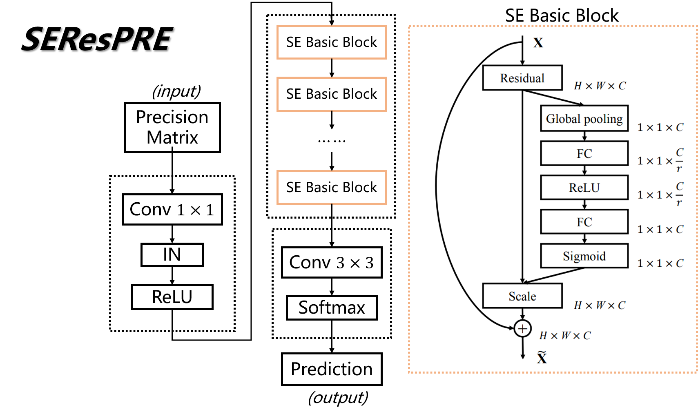
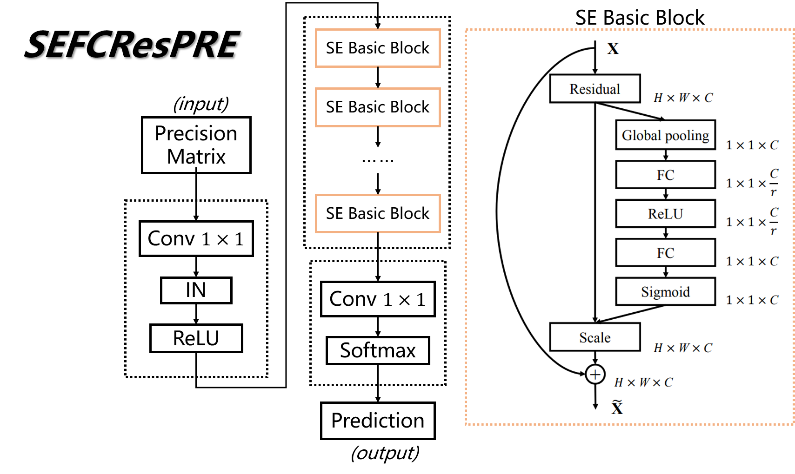
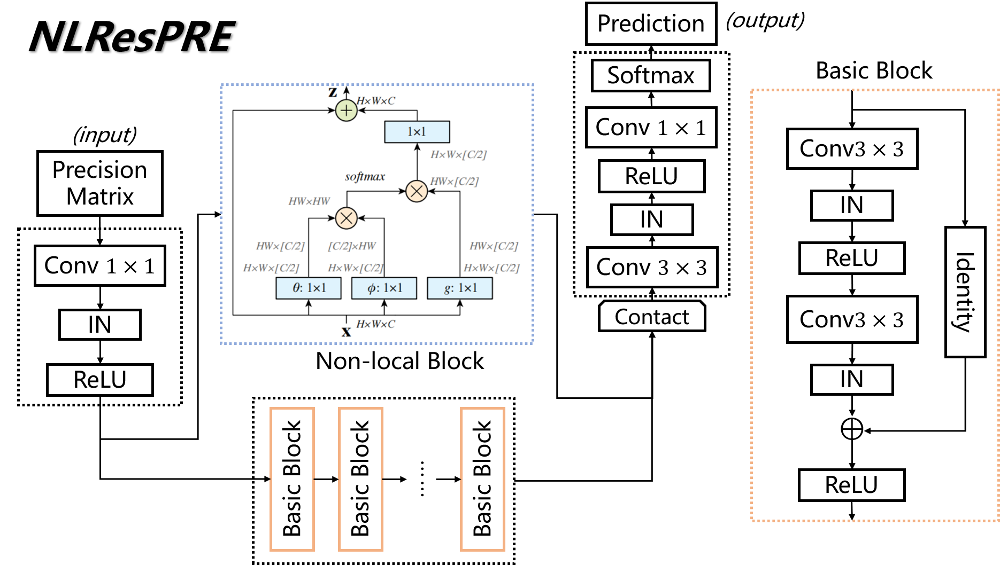

# Models
Here we illustrate the structures of the three models in our repository.

## Model 1: DeepCov model for protein contact map prediction. (Baseline)

## Model 2: ResPRE model for protein contact map prediction. (Baseline)

## Model 2.5: FCResPRE model for protein contact map prediction. (Baseline)

## Model 3: CbamResPRE model for protein contact map prediction. (Ours)

## Model 3.5: CbamFCResPRE model for protein contact map prediction. (Ours)

## Model 4: SEResPRE model for protein contact map prediction. (Ours)

## Model 4.5: SEFCResPRE model for protein contact map prediction. (Ours)

## Model 5: NLResPRE model for protein contact map prediction. (Ours)

## Model 6: HaloResPRE model for protein contact map prediction. (Ours)

