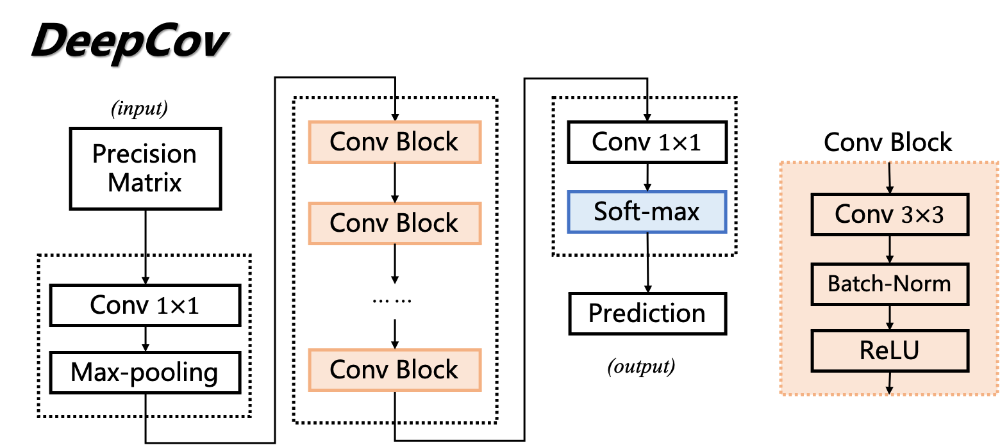
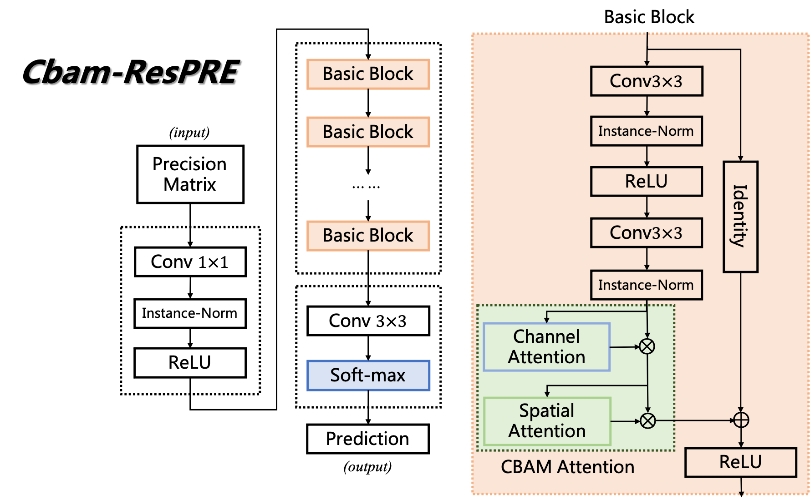
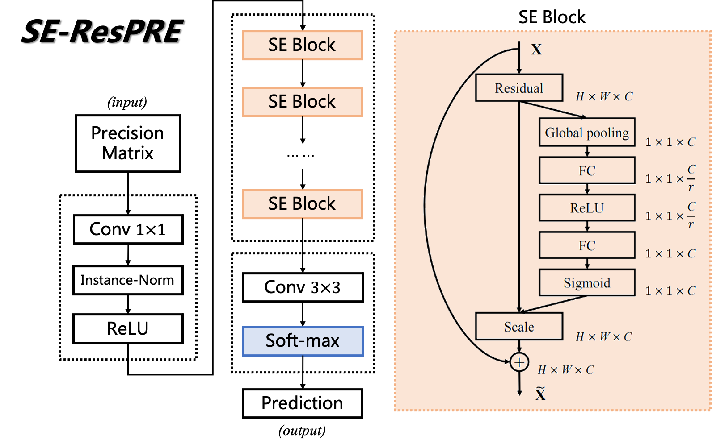
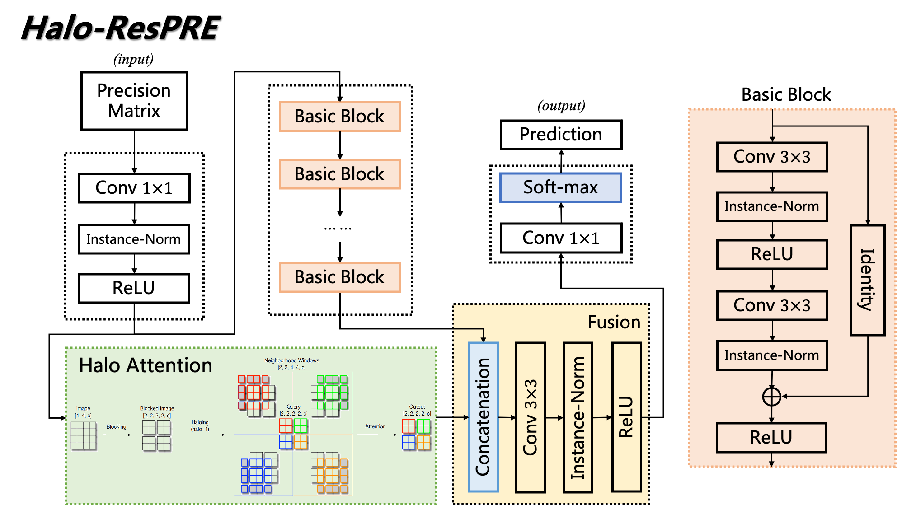
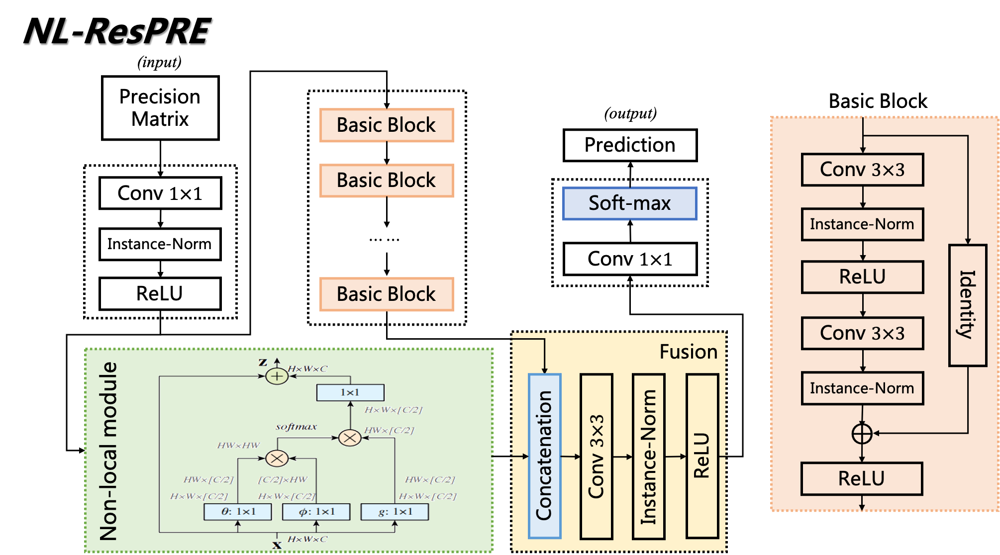
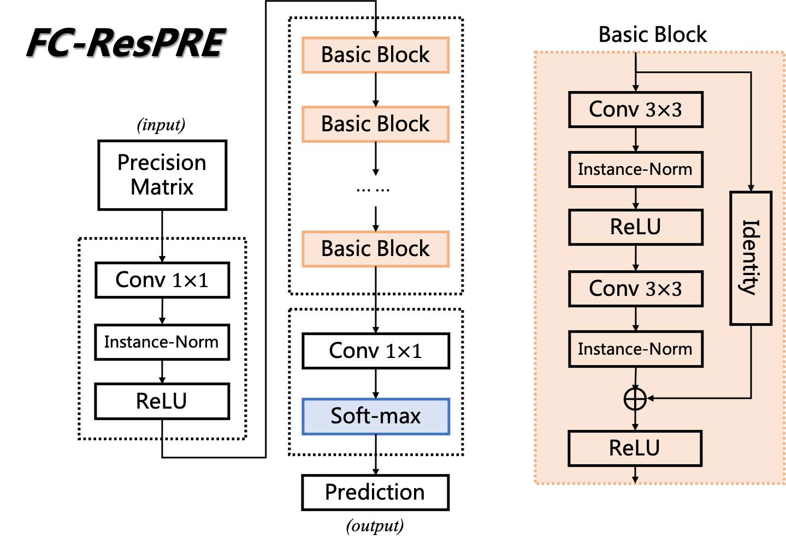
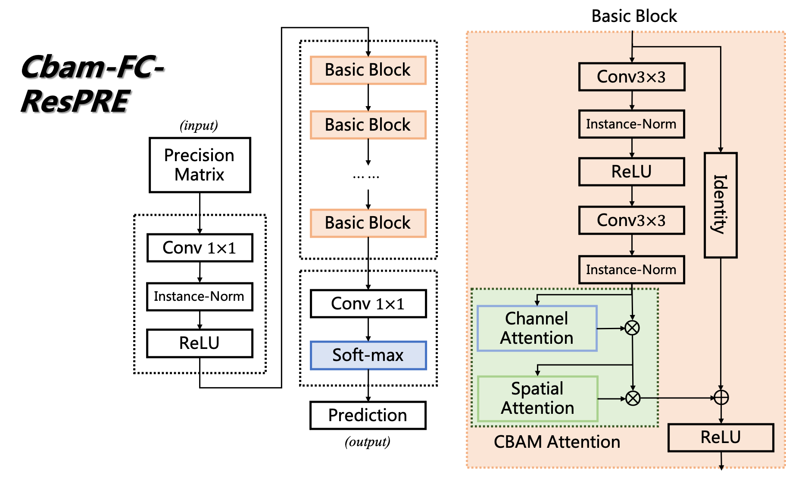
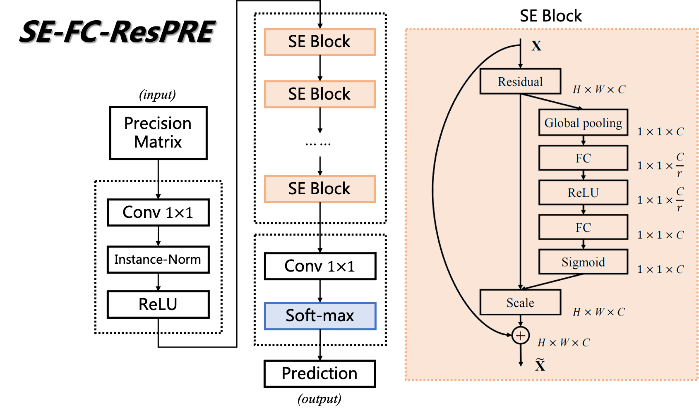

# Models

Here we illustrate the structures of the models in our repository.

## Model 1: DeepCov

## Model 2: ResPRE

## Model 3: Cbam-ResPRE

## Model 4: SE-ResPRE model

## Model 5: Halo-ResPRE

## Model 6: NL-ResPRE

## Model 7: FC-ResPRE for Ablation Studies

## Model 8: Cbam-FC-ResPRE for Ablation Studies

## Model 9: SE-FC-ResPRE for Ablation Studies

## Model 10: Dilated-Resnet34 (Dilated Residual Network) for Ablation Studies

Here is a brief introduction of the dilated residual network we have implemented.

- Input layer: a convolution block of output channels 16 and kernel size 7;
- Input feature extractor: two convolution blocks of output channels 16 and kernel size 3, and two convolution blocks of output channels 32 and kernel size 3;
- Layer 1: 3 residual blocks of output channels 64 and kernel size 3.
- Layer 2: 4 residual blocks of output channels 96 and kernel size 3.
- Layer 3: 6 residual blocks of output channels 128, kernel size 3 and dilation 2;
- Layer 4: 3 residual blocks of output channels 160, kernel size 3 and dilation 4;
- Output feature extractor: two convolution blocks of output channel 160, kernel size 3 and dilation 2, and two convolution blocks of output channel 160 and kernel size 3.
- Output layer: a convolution block of output channels 10 and kernel size 1.